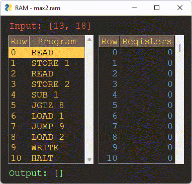

RAM - Random Access Machine
==

Input (aka the input tape)
--
* a sequence of integral numbers 
* the sequence is read-only, read number by number, in left to right order

Output (aka the output tape)
--
* a sequence of intergal numbers
* the sequence is write-only, written number by number, in left to right order

RAM registers
--
* registers R[0], R[1], R[2], ... are indexed by a natural number 
* register R[0] is the accumulator which occurs implicitly in several instructions

* each register holds an (arbitrarily large) integral number
* when the program starts, all registers hold the number 0
* there is a potentially infinite number of registers available

RAM instructions
--
| instruction | explanation |
|----|----|
| READ    | read next number from input to accumulator |
| WRITE   | write content of accumulator to output |
| LOADIMM i | load constant i into accumulator |
| LOAD i  | copy the number in register R[i] to accumulator |
| STORE i | copy the number in the accumulator to register R[i] |
| ADD i   | add the number in register R[i] to the value in the accumulator |
| SUB i   | sub the number in register R[i] from the value in the accumulator |
| JUMP i  | unconditional jump to instruction i |
| JZERO i | conditional jump to instruction i, only if the content of the accumulator is equal to zero |
| JGTZ i  | conditional jump to instruction i, only if the content of the accumulator is larger than zero |
| HALT    | halts program execution |

RAM program
--
* a program is a text file containing one valid RAM instruction per line
* the instructions (lines) are numbered by natural numbers, starting with 0
* the program instructions are executed line by line, starting at 0 
* when a jump takes place, execution is continued at the line number indicated
   